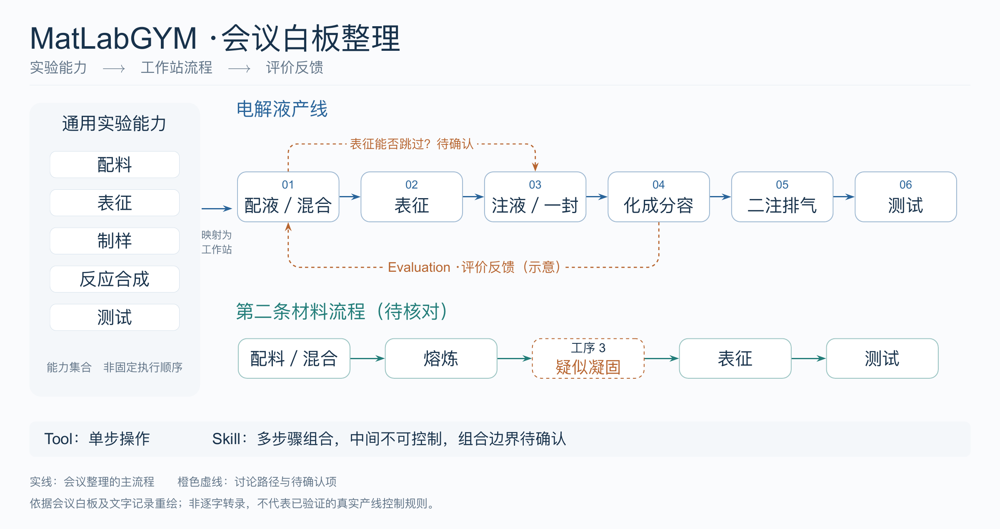

# 会议白板重绘



- [PDF 矢量图](meeting-whiteboard.pdf)
- [LaTeX / TikZ 可编辑源码](meeting-whiteboard.tex)
- [PNG 预览](meeting-whiteboard.png)

图中保留会议白板的通用实验能力、六阶段电解液流程、另一条材料流程及评价反馈。电解液阶段名称依据会议文字记录统一为：配液／混合、表征、注液／一封、化成分容、二注排气、测试。

橙色虚线表示讨论项：表征能否跳过尚未确认；评价反馈箭头为示意，不指定真实回流工艺。下方第三道工序字迹暂辨为“疑似凝固”，因此明确保留待核对标记。左侧模块表示能力集合，不定义执行顺序。图中不指定启停权限、耗时或成本。

这是依据会议白板与文字记录整理的重绘图，不是逐字转录或经过平台验证的 SOP。源照片、个人信息、API key 和接口配置均未纳入本目录。

## 重建

需要 Tectonic（或 XeLaTeX）、`xeCJK`、TikZ，以及 Noto Sans CJK SC 或 macOS PingFang SC 字体。西文字体使用 TeX Gyre Heros，缺失时使用 Arial。优先使用 Noto Sans CJK SC；不同字体的排版可能略有差异。

从仓库根目录执行：

```bash
tectonic --outdir docs/figures docs/figures/meeting-whiteboard.tex
pdftoppm -scale-to 2400 -singlefile -png \
  docs/figures/meeting-whiteboard.pdf docs/figures/meeting-whiteboard
```

也可在 `docs/figures` 中执行 `xelatex meeting-whiteboard.tex`。PDF 为单页矢量图，PNG 供 GitHub 页面预览。
